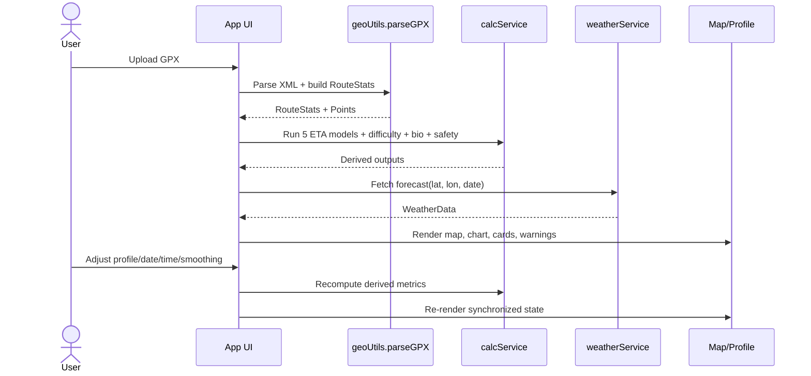

# TrekkingTime Pro - Technical Guide

Version: 1.0  
Date: 2026-04-26  
Scope: Internal engineering reference for architecture, algorithms, operations, quality, and roadmap.

## 1. System Summary

TrekkingTime Pro is a browser-only geospatial analytics application that transforms GPX tracks into planning intelligence for hiking and trail movement:

1. Deterministic route metrics from GPS/elevation streams.
2. Multi-model ETA estimation with robust aggregation.
3. Terrain and weather contextualization for risk-aware planning.
4. Interactive map/profile coupling to support route interpretation.

Primary design goals:

1. Explainability over black-box complexity.
2. Zero-backend deployment.
3. Fast first-use with no account creation and no API key requirements.
4. Privacy by default, with only optional weather enrichment calls.

## 2. Runtime Architecture

### 2.1 High-level components

1. UI orchestration: App component handles event orchestration and state composition.
2. Geospatial ETL + transforms: geo service parses GPX and computes geometric derivatives.
3. Domain analytics: calculation service performs route time, difficulty, bio, and safety models.
4. External enrichment: weather service fetches Open-Meteo data and maps WMO codes.
5. Visualization layer:
   1. Metrics cards for scalar route facts.
   2. Leaflet map for geospatial context and route exploration.
   3. Recharts elevation profile for gradient-aware terrain interpretation.

### 2.2 Data ownership and boundaries

1. Source of truth for route: `RouteStats` and `GPXPoint[]`.
2. Source of truth for scenario assumptions: fitness, pace, pack weight, breaks, date, start time.
3. Derived projections: estimations, aggregate, bio metrics, safety flags, difficulty labels.
4. Interaction sync state: hovered point shared between map and profile.

### 2.3 Sequence flow: GPX upload to dashboard

## 3. ETL and Data Engineering Pipeline

### 3.1 Ingestion

1. Input format: GPX XML containing one or more `trkpt` elements with `lat`, `lon`, and optional `ele`.
2. Parser: `DOMParser` executed in browser runtime.
3. Validation: hard fail if no track points are found.

### 3.2 Cleaning

1. Elevation micro-noise suppression: ascent/descent accumulation ignores `|delta elevation| <= 0.5m`.
2. Distance/slope guard rails:
   1. Skip zero-distance segments.
   2. Avoid unstable slope division with minimum distance threshold checks.

### 3.3 Transformation

1. Haversine distance per adjacent point pair.
2. Cumulative route distance (`distFromStart`) assigned to every point.
3. Segment slope computed as:
   1. $slope\% = \frac{\Delta elevation}{distance\_meters} \times 100$.
4. Aggregate route fields:
   1. Distance, gain, loss, min/max altitude.
   2. Average absolute slope intensity.

### 3.4 Feature extraction

1. Slope distribution buckets over segment distance:
   1. Steep down: below -15%.
   2. Moderate down: -15% to -8%.
   3. Mild down: -8% to -2%.
   4. Flat: -2% to 2%.
   5. Mild up: 2% to 8%.
   6. Moderate up: 8% to 15%.
   7. Steep up: above 15%.
2. Route characterization tags:
   1. High Altitude / Alpine.
   2. Steep Start.
   3. Uphill Finish.
   4. Technical/Steep.
   5. Mostly Flat.

### 3.5 Visualization preparation

1. Downsample raw points to target about 1000 chart points.
2. Recompute slope on downsampled data.
3. Apply moving-average smoothing windows based on selected smoothing level.
4. Preserve Y-axis from raw data to avoid chart frame drift.

## 4. Core Domain Models

### 4.1 Type contracts (logical)

1. `GPXPoint`:
   1. `lat`, `lon`, `ele`.
   2. `distFromStart` in km.
   3. optional `slope` in %.
2. `RouteStats`:
   1. Scalar route metrics.
   2. full point stream.
   3. slope distribution.
3. `CalculationContext`:
   1. route stats + user profile assumptions.
4. `TimeEstimation`:
   1. method name.
   2. time in minutes.
   3. descriptive metadata.
5. `SmartAggregate`:
   1. selected value.
   2. selection mode (`MEAN` or `MEDIAN`).
   3. reason string.

### 4.2 State transitions

1. New GPX upload resets weather/hover/smoothing context and seeds route state.
2. Scenario controls trigger recalculation pass.
3. Date changes trigger weather request and safety projection refresh.
4. Hover events update shared pointer anchor for synchronized map/profile markers.

## 5. Algorithm Specification

### 5.1 Speed synthesis

User speed is composed from:

1. Fitness base speed.
2. Pace style multiplier.
3. Pack-weight correction (Langmuir-inspired reduction).

### 5.2 Break policy

1. If breaks enabled and pace is hiking style:
   1. Add 10 minutes per completed hour of movement.
2. If pace is running type:
   1. Skip break augmentation.

### 5.3 Naismith variant

Formula:
$$
T = \left(\frac{D}{V} + \frac{G}{C}\right) \times 60
$$
Where:

1. $D$: distance in km.
2. $V$: effective user speed in km/h.
3. $G$: ascent in meters.
4. $C$: climb factor (600m/h default, 800m/h for top fitness tiers).

### 5.4 Tobler integration

Per segment velocity:
$$
V_s = 6e^{-3.5|m+0.05|}
$$
Where $m$ is slope ratio (not percent). Segment time is integrated across route and adjusted by user speed scaling.

Numerical safety:

1. Clamp minimum $V_s$ to 0.5 km/h.

### 5.5 Munter effort units

Model:

1. Horizontal units: route km.
2. Vertical units: ascent / 100.
3. Time: `(distance units + vertical units) / speed`.
4. Heavy-pack penalty adds descent-linked term.

### 5.6 Swiss DIN-style hybrid

1. Horizontal and vertical times computed separately.
2. Combined with:

$$
T = \max(T_h, T_v) + 0.5\min(T_h, T_v)
$$

### 5.7 Petzoldt energy-mile conversion

1. Convert ascent to equivalent distance using 152.4m per equivalent km.
2. Add to horizontal distance.
3. Divide by effective speed.

### 5.8 Robust aggregate selector

1. Compute mean and median over all model outputs.
2. Compute disagreement ratio:

$$
\delta = \frac{|mean - median|}{median}
$$
1. If $\delta > 0.10$, choose median.
2. Else choose mean.

Rationale:

1. Median protects against slope-sensitive outliers and noisy elevation traces.

## 6. Visualization Engineering

### 6.1 Map

Library: React-Leaflet + Leaflet.

Features:

1. Multi-basemap support:
   1. OpenTopoMap.
   2. OpenStreetMap.
   3. CyclOSM.
   4. Esri World Imagery.
2. Route polyline with start/end markers.
3. Hover circle marker bound to shared hover state.
4. Fit-bounds recenter after route load.

Interaction strategy:

1. Throttle pointer move handling to about every 50ms.
2. Approximate nearest point search with Euclidean lat/lon delta and stride-2 scan.

### 6.2 Elevation profile

Library: Recharts AreaChart.

Features:

1. Gradient stroke/fill driven by slope interpolation.
2. Smoothing levels: Raw, Low, Med, High, Max.
3. Tooltip with distance, altitude, slope percentage, and terrain text.
4. Cross-view reference line and point synchronized with map hover.

Performance choices:

1. Downsampling before smoothing.
2. Stable raw-derived Y-axis domain.

## 7. Weather Service Contract

### 7.1 Endpoint usage

Open-Meteo daily and hourly fields are requested for one date and one coordinate pair.

Daily fields consumed:

1. weather code.
2. max/min temperature.
3. apparent max temperature.
4. precipitation sum.
5. max precipitation probability.
6. max wind speed and gusts.
7. max UV index.
8. sunrise/sunset.

Hourly fields aggregated by mean:

1. pressure.
2. cloud cover.
3. relative humidity.

### 7.2 Error model

1. Non-2xx responses throw API failure.
2. Missing expected daily arrays throw semantic data error.
3. UI shows recoverable user-facing message.

### 7.3 Auth, rate limits, caching

1. No authentication in current implementation.
2. No explicit cache layer.
3. For production at scale, introduce request deduplication and TTL cache keyed by `(lat, lon, date)`.

## 8. Safety and Bio Metrics Logic

### 8.1 Difficulty score

1. Effort points: `distance + ascent/100`.
2. Threshold mapping from Very Easy to Extreme.
3. Additional descriptors from route structure heuristics.

### 8.2 Calories

1. Uses MET-like baseline adjusted by pace and average grade.
2. Total carried mass includes estimated body mass and pack contribution.

### 8.3 Water

1. Base hourly hydration rate.
2. Incremental adjustments for high temperature, pace intensity, and grade.

### 8.4 Daylight safety

1. Parse selected start time.
2. Compute finish time from aggregate ETA.
3. Compare against sunset to flag possible night finish.

## 9. Non-Functional Requirements

### 9.1 Performance

Targets:

1. Initial parse and render under 2 seconds for common GPX files under 10k points on modern hardware.
2. Pointer interactions remain smooth under throttle strategy.
3. Chart redraw remains interactive due to downsampling.

### 9.2 Privacy

1. GPX data processing is local.
2. Only route-start coordinate/date is sent externally for weather.

### 9.3 Reliability

1. Deterministic computations for reproducible outputs.
2. Graceful weather-failure handling without blocking core route analytics.

### 9.4 Accessibility

Current status:

1. Basic semantic structure is present.
2. Additional accessibility improvements recommended:
   1. Explicit ARIA for toggles/controls.
   2. Keyboard interaction pass over map-linked controls.
   3. Color-contrast and color-blind palette checks for slope gradients.

## 10. Testing Strategy

### 10.1 Unit tests (highest priority)

1. Geospatial utilities:
   1. Haversine distance sanity tests.
   2. GPX parsing for valid/invalid/no-point inputs.
   3. Slope bucket classification boundaries.
2. Calculation service:
   1. Each model returns monotonic increases with distance/gain increments.
   2. Smart aggregate switches correctly at 10% threshold.
   3. Break policy behaves correctly for running vs hiking paces.
   4. Safety logic flags sunset overrun correctly.
3. Weather service:
   1. WMO code mapping.
   2. Daily/hourly parsing and aggregation defaults.

### 10.2 Integration tests

1. Upload GPX -> dashboard data populated.
2. Control changes -> ETA and difficulty updates.
3. Date change -> weather refresh and error fallback behavior.
4. Hover interactions -> map/profile synchronization.

### 10.3 End-to-end tests

1. Common route planning happy path.
2. Large GPX stress path.
3. API failure path with route analytics still functional.

## 11. Operational Guide

### 11.1 Local development

1. Install dependencies: `npm install`.
2. Start dev server: `npm run dev`.
3. Build production bundle: `npm run build`.
4. Preview production output: `npm run preview`.

### 11.2 Deployment

1. Deploy generated static assets to a static host.
2. Ensure HTTPS for API and map tile compatibility.
3. Monitor third-party tile/API terms for production usage.

### 11.3 Observability recommendations

Current codebase has minimal telemetry. Recommended additions:

1. Structured client logs for parse and weather failures.
2. Optional analytics for interaction latency and route size distribution.
3. Error boundary around top-level UI region.

## 12. Security and Compliance Notes

1. Input security:
   1. GPX parsing is local, but still validate and constrain file handling.
2. External dependencies:
   1. Keep Leaflet/Recharts/React dependencies up to date.
3. Data handling:
   1. No long-term storage of route data in current architecture.
4. Supply chain:
   1. Enable lockfile and dependency scanning in CI.

## 13. Production Hardening Checklist

1. Add automated test suites (unit/integration/e2e) and gate merges in CI.
2. Add static analysis and linting pipeline.
3. Add browser compatibility matrix and smoke tests.
4. Implement weather-request cache and cancellation for rapid date changes.
5. Add Web Worker support for very large GPX parsing/smoothing workloads.
6. Improve timezone correctness for daylight calculations across locales.
7. Add configurable constants for all model coefficients and thresholds.
8. Add i18n formatting for units, date/time, and locale preferences.

## 14. Known Limitations

1. No user profile persistence across sessions.
2. No multi-day route stage planning.
3. No probabilistic uncertainty envelope around ETA.
4. Weather sampled at one coordinate rather than along full route.
5. GPX signal quality can still affect slope-derived methods when data is highly noisy.

## 15. Extension Roadmap

### 15.1 Data and analytics

1. Multi-file activity history ingestion.
2. Personal calibration model trained from completed activities.
3. Terrain segmentation and route difficulty timeline.

### 15.2 Product and UX

1. Saved planning scenarios.
2. Export options (PDF, JSON, ICS timeline).
3. Multi-language support.

### 15.3 Engineering

1. Introduce domain configuration package for formulas/thresholds.
2. Add deterministic fixture corpus for regression tests.
3. Add benchmark suite for parser and chart preparation cost.

## 16. Glossary

1. GPX: XML schema for GPS track exchange.
2. ETA: Estimated time of arrival/finish.
3. Haversine: Great-circle distance approximation on a sphere.
4. WMO code: Standardized weather condition code.
5. Equivalent flat distance: Distance transformed to flat-ground effort proxy.

## 17. Final Safety Disclaimer

All estimates are planning aids, not operational guarantees. Field conditions, route changes, weather shifts, and human factors can materially change outcomes. Users remain responsible for navigation, risk assessment, and emergency preparedness.
